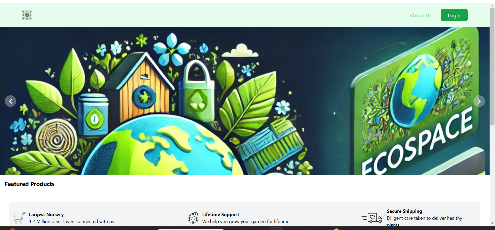
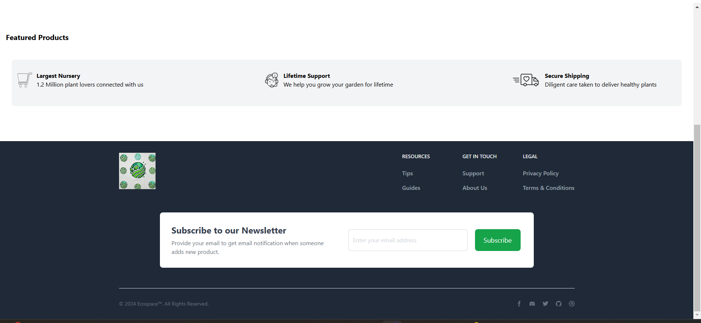

# Ecospace 🌷

Ecospace is a digital marketplace for eco-friendly products, designed to promote sustainability by making such products accessible and convenient for everyone. Our platform offers an extensive selection of eco-friendly products, from gardening supplies to sustainable household items, accompanied by informative content within a user-friendly and secure shopping environment.
---


## Why Ecospace?

Rediscover the joys of gardening and sustainable living with Ecospace. We address common challenges faced by urban dwellers and others who have limited access to local nurseries and eco-friendly products:

- **Diverse Product Selection:** Our vast range includes everything from basic gardening supplies to rare plant species.
- **Detailed Product Information:**Each listing provides comprehensive care instructions and sustainability benefits, empowering you to make informed decisions.
- **Convenient Shopping Experience:** Enjoy an intuitive interface and a secure, hassle-free checkout process.

---


## Our Motive

At Ecospace, we strive to democratize gardening and sustainable practices, making them accessible to everyone. By enabling more people to participate in eco-friendly activities, we are working towards a healthier, greener planet.
---

## Features

- **Extensive Catalog of Eco-Friendly Products** Explore a broad selection of products with all the information you need to choose wisely.
- **Intuitive User Interface** Our platform is designed for ease of navigation, ensuring a seamless user experience.
- **Professional Gardening Support**  Access tips and guidance from experts to help your garden thrive.
- **Secure Shopping:** Enjoy a safe shopping experience with robust payment options.

---

### Screen shots

### Screen shots

### Dashboard 



---
### Installation Instructions

### Prerequisites

- Python 3.x
- Git
- Virtualenv (recommended)

### Getting Start

Clone the Ecospace repository and set up your environment:

```bash
$ git clone https://github.com/YashSahsani/Ecospace.git
$ cd Ecospace
```

### Create and activate a virtual environment:

```bash
$ pip install virtualenv
$ virtualenv venv
$ source venv/bin/activate  # On Windows use `venv\Scripts\activate`
$  pip install -r requirements.txt
```

### Populating the Database
```bash
$ python manage.py loaddata data.json
```

### Access Credentials

- Email: admin@Ecospace.com
- Password: Admin@123
